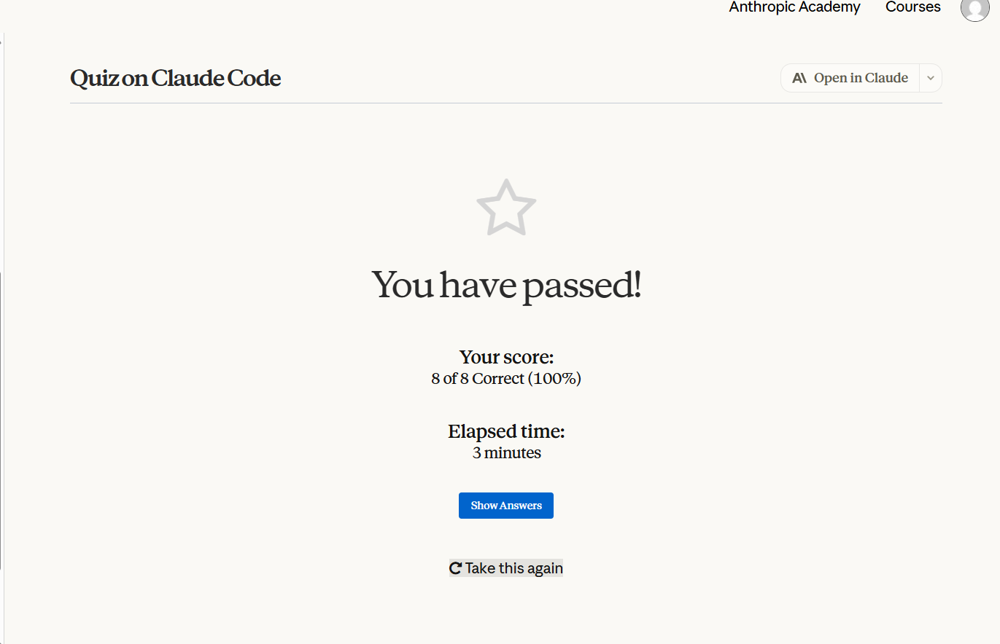
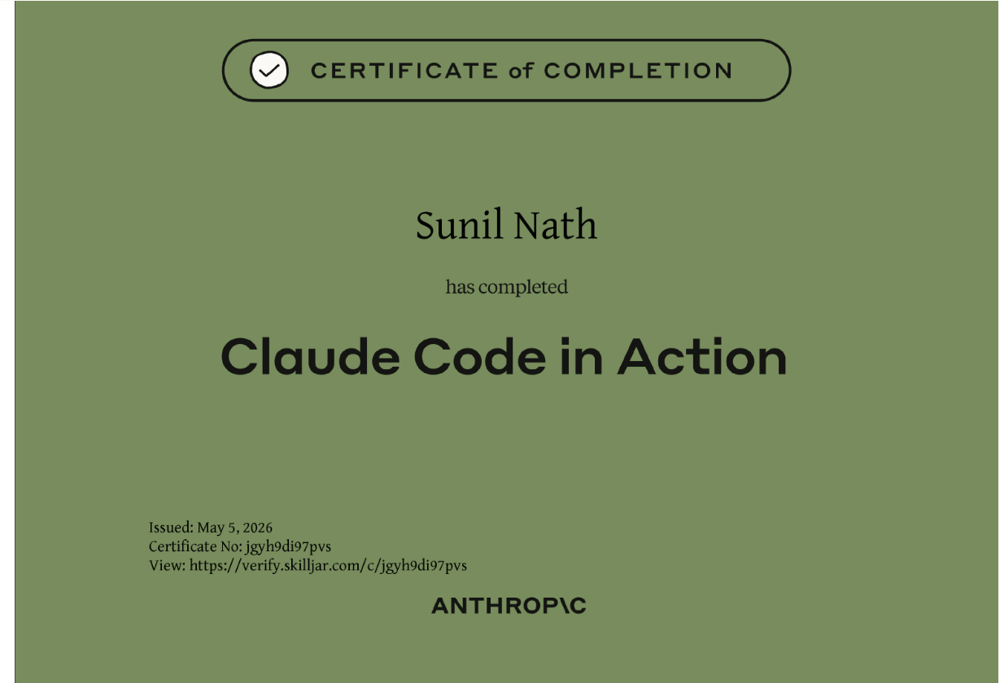

## Firstbuild

Python CLI Task Tracker built with a test-first workflow.

## Project Structure

firstbuild/
- README.md
- CLAUDE.md
- spec.md
- src/
- tests/

## Progress Checklist

### V1.0 - Project Setup and Specification

- [x] Create CLAUDE.md with project-specific instructions
- [x] Write spec.md with at least 3 quality gates
- [x] Write at least 5 acceptance criteria in Given/When/Then format
- [x] Add, commit, and push to GitHub

### V1.1 - Test-First Development

- [x] Write failing tests for first feature before implementation
- [x] Implement the feature until all tests pass
- [x] Refactor while keeping tests green
- [x] Repeat red/green/refactor for at least 2 additional features
- [x] Ensure commit history shows tests committed before implementation
- [x] Add, commit, and push to GitHub

### V1.2 - Complexity and Polish

- [x] Complete one multi-step single-file task using the workflow
- [x] Complete one multi-file design task using the workflow
- [x] Document workflow differences for each complexity level
- [ ] Ensure all tests pass in the final submission
- [ ] Add, commit, and push to GitHub

### Stretch Challenges

- [ ] Add custom slash commands in .claude/commands/
- [ ] Add AGENTS.md in a subdirectory with scoped instructions
- [ ] Show CLAUDE.md refinement over time in commit history

## Planned Stack

- Runtime: Python 3.11+
- Language: Python
- Tests: pytest

## Local Setup

python -m venv .venv
.venv\Scripts\activate
pip install pytest

## Test Command

pytest

## V1.2 Workflow Notes

### Multi-step single-file task

- Scope: Implemented command parsing and command routing in `src/cli.py`.
- Workflow: Added failing CLI tests first (`tests/test_app.py`), then implemented only enough command flow to pass.
- Validation: Ran full test suite after implementation to ensure no regressions in domain logic.

### Multi-file design task

- Scope: Added JSON persistence layer in `src/store.py` and integrated persistence behavior in `src/cli.py`.
- Workflow: Added failing persistence tests first (`tests/test_store.py`, `tests/test_app_persistence.py`), then implemented storage API and integration.
- Design decision: Kept `main(..., tasks=...)` for in-memory test mode while adding `storage_path` for file-backed mode.
- Validation: Ran full test suite after integration and after refactor checkpoints.

## Quiz Evidence

- Course: Claude Code in Action
- Quiz: Claude Code final quiz
- Result: 8/8 correct (100%)
- Elapsed time: 3 minutes

Screenshot evidence can be stored at:

- `assist/claude-code-quiz-pass.png`

## Certificate Evidence

- Course completion certificate: Claude Code in Action
- Learner: Sunil Nath
- Issued: May 5, 2026
- Certificate verification link: https://verify.skilljar.com/c/jgyh9di97pvs

Certificate image can be stored at:

- `assist/claude-code-certificate.png`

